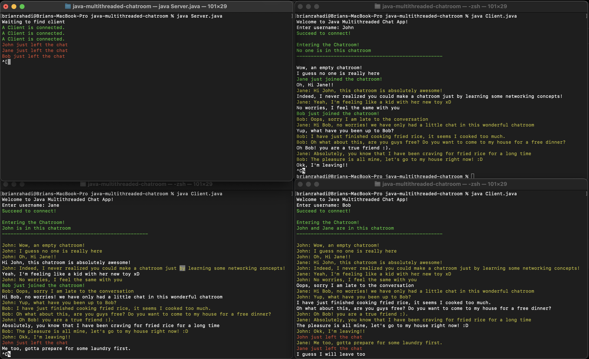

# java-multithreaded-chatroom

## What is this?
A fully functional chatroom with many features built in Java. This chatroom allows everyone with the same Public IP Address and Port to chat inside.

## Features
- Fully responsive chatting app
- Message when other user just joined or left the chatroom
- Message who is in this chatroom for a user that just joined

## How to Run
- Download Java (My java was version 15)
- Download this files (of course!, just to make sure :) )
- Have the first terminal to run Server.java
- After that, Have the second and consecutive terminal to run Client.java
- Wait for magic!

## Acknowledgements
- My Object-Oriented Programming Professor :) (This project is made from scratch, it is not part of any assignment, thus I am free to publish this file!)
- Java Oracle docs